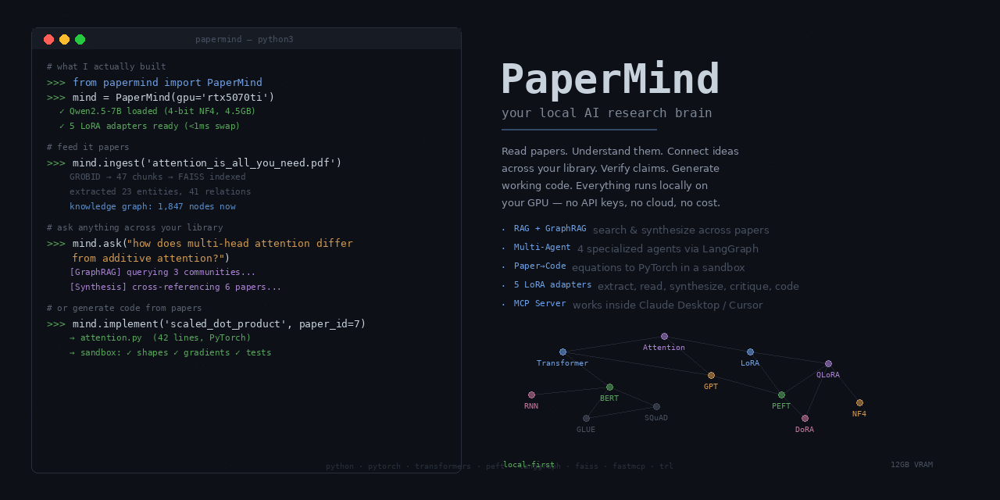

<p align="center">
  
</p>

# PaperMind

**Local AI research system for paper understanding, knowledge graphs, and code generation — running entirely on a single GPU (12GB VRAM).**

PaperMind ingests research papers (PDF), extracts structured content with LaTeX equations, builds a knowledge graph of entities and relationships, embeds everything into a vector store, and provides a RAG-grounded chat interface powered by a locally-running 7B parameter LLM with 5 specialized LoRA adapters.

No cloud APIs. No data leaves your machine.

---

## Architecture

```
                                    ┌─────────────────────────┐
                                    │     Streamlit UI        │
                                    │  Chat | Papers | Search │
                                    │  KG | Benchmarks | Sys  │
                                    └───────────┬─────────────┘
                                                │
                                    ┌───────────▼─────────────┐
                                    │      FastAPI Backend     │
                                    │  /api/chat  /api/papers  │
                                    │  /api/search  /api/health│
                                    └───────────┬─────────────┘
                                                │
                 ┌──────────────────────────────┼──────────────────────────────┐
                 │                              │                              │
     ┌───────────▼──────────┐    ┌──────────────▼──────────┐    ┌──────────────▼──────────┐
     │    RAG Pipeline       │    │   Ingestion Pipeline     │    │   Data Stores           │
     │                       │    │                          │    │                          │
     │  Hybrid Retriever     │    │  PDF Parser (3 modes):   │    │  ChromaDB (vectors)     │
     │    (Vector + KG)      │    │    - Hybrid (GROBID +    │    │  SQLite (KG + papers)   │
     │  Cross-Encoder        │    │      MinerU)             │    │  FAISS (optional)       │
     │    Reranker (BGE)     │    │    - GROBID only         │    │                          │
     │  Lost-in-Middle       │    │    - PyMuPDF fallback    │    └──────────────────────────┘
     │    Ordering           │    │                          │
     │  Context Compression  │    │  Parent-Child Chunker    │
     │  LLM Generation       │    │  Entity Extractor        │
     │    (Qwen 7B, NF4)     │    │  LaTeX Extractor         │
     └───────────────────────┘    │  Embedding Pipeline      │
                                  └──────────────────────────┘
```

### Component Stack

| Layer | Technology | Purpose |
|-------|-----------|---------|
| **LLM** | Qwen2.5-Coder-7B-Instruct | NF4 quantized (~5.2GB VRAM), 48.9 tok/s streaming |
| **Reranker** | BAAI/bge-reranker-v2-m3 | 568M param cross-encoder, FP32, unloaded before LLM |
| **Embeddings** | nomic-ai/nomic-embed-text-v1.5 | 768d, asymmetric prefixes, L2-normalized |
| **Vector Store** | ChromaDB | Persistent, metadata filtering, cosine similarity |
| **Knowledge Graph** | SQLite + networkx | Entities, relationships, subgraph traversal |
| **PDF Parsing** | GROBID + MinerU | Metadata + LaTeX equations (9.17/10 formula benchmark) |
| **Backend** | FastAPI | REST API, SSE streaming for ingestion progress |
| **Frontend** | Streamlit | Interactive UI for all features |
| **Containerization** | Docker | GROBID service, code execution sandbox |

### VRAM Budget (12GB RTX 5070 Ti)

| Component | VRAM | When |
|-----------|------|------|
| Qwen2.5-Coder-7B (NF4) | 5.2 GB | Query time |
| BGE-Reranker-v2-m3 (FP32) | 2.3 GB | Reranking (unloaded before LLM) |
| nomic-embed-text-v1.5 | 0.09 GB | Always loaded |
| MinerU pipeline | ~6 GB | Ingestion only |
| **Peak** | **5.3 GB** | Query time |
| **Headroom** | **6.2 GB** | |

---

## Quick Start

### Prerequisites

- Python 3.12+
- NVIDIA GPU with 12GB+ VRAM
- Docker (for GROBID)
- [uv](https://docs.astral.sh/uv/) package manager

### Installation

```bash
git clone https://github.com/shivam7569/papermind.git
cd papermind

# Install dependencies
uv sync
uv sync --extra dev        # Dev tools (pytest, ruff, mypy)
uv sync --extra streamlit  # Streamlit UI

# Start GROBID (PDF parsing service)
docker run -d --name grobid --restart unless-stopped \
  -p 8070:8070 --cgroupns=host \
  -v /sys/fs/cgroup:/sys/fs/cgroup:ro \
  lfoppiano/grobid:0.8.1

# Set up MinerU (isolated venv for equation extraction)
uv venv .venv-mineru --python 3.12
uv pip install --python .venv-mineru mineru doclayout-yolo ultralytics \
  "transformers>=4.40,<5" ftfy shapely pyclipper omegaconf einops dill

# Configure
cp .env.example .env
# Edit .env with your tokens (optional):
#   GITHUB_TOKEN=ghp_...   (for dataset building)
#   HF_TOKEN=hf_...        (for faster model downloads)
```

### Usage

```bash
# Ingest a paper
papermind ingest docs/attention_is_all_you_need.pdf

# Search across ingested papers
papermind search "attention mechanism in transformers"

# Start the API server
papermind serve

# Start the Streamlit UI
uv run streamlit run src/papermind/ui/app.py --server.port 8501

# Run tests
uv run pytest tests/ -v
```

---

## Project Structure

```
papermind/
├── config/
│   └── settings.yaml              # All configuration (LLM, embedding, vector store, etc.)
├── data/
│   ├── BENCHMARKS.md              # Comprehensive benchmark report
│   ├── benchmark_report.json      # Structured benchmark data
│   └── vector_benchmark_results.json
├── docker/
│   ├── Dockerfile.grobid          # Custom GROBID with JDK fix for cgroups v2
│   └── Dockerfile.sandbox         # Python sandbox for code execution
├── docs/                          # 50 landmark AI papers for testing
├── src/papermind/
│   ├── __init__.py
│   ├── cli.py                     # CLI: ingest, search, serve, generate
│   ├── config.py                  # Pydantic Settings (YAML + env vars)
│   ├── models.py                  # Data models: Paper, Section, Chunk, Entity, etc.
│   ├── services.py                # Centralized ServiceRegistry (singleton, thread-safe)
│   ├── api/                       # FastAPI backend
│   │   ├── app.py                 # App factory with CORS
│   │   ├── dependencies.py        # Dependency injection
│   │   └── routes/
│   │       ├── health.py          # GET /health, /health/detailed
│   │       ├── papers.py          # GET /papers, POST /papers/ingest (SSE)
│   │       ├── search.py          # POST /search, GET /kg/entities
│   │       └── chat.py            # POST /chat/rag
│   ├── infrastructure/            # Core services
│   │   ├── embedding.py           # EmbeddingService (nomic-embed, Matryoshka)
│   │   ├── vector_store.py        # ChromaDB vector store
│   │   ├── faiss_store.py         # FAISS vector store (Flat/IVF/HNSW)
│   │   ├── knowledge_graph.py     # SQLite + networkx KG
│   │   ├── paper_store.py         # SQLite paper metadata registry
│   │   ├── llm_client.py          # Unified LLM client (local + Ollama)
│   │   └── local_model.py         # Qwen2.5-Coder-7B with NF4 quantization
│   ├── ingestion/                 # PDF → structured data pipeline
│   │   ├── pdf_parser.py          # PyMuPDF parser (fast fallback)
│   │   ├── grobid_parser.py       # GROBID parser (ML-based metadata)
│   │   ├── mineru_parser.py       # MinerU parser (LaTeX equations)
│   │   ├── hybrid_parser.py       # GROBID metadata + MinerU body
│   │   ├── chunker.py             # Parent-child text chunking
│   │   ├── embedder.py            # Embedding pipeline orchestrator
│   │   ├── entity_extractor.py    # Heuristic entity/relationship extraction
│   │   └── latex_extractor.py     # LaTeX equation extraction
│   ├── rag/                       # Retrieval-Augmented Generation
│   │   ├── retriever.py           # Hybrid retriever (vector + KG + RRF)
│   │   ├── reranker.py            # BGE cross-encoder reranker
│   │   ├── context.py             # Lost-in-middle + dedup + compression
│   │   └── pipeline.py            # RAG orchestrator
│   ├── data/                      # Dataset builders
│   │   ├── pwc_dataset.py         # Papers with Code dataset (git clone)
│   │   ├── pwc_dataset_fast.py    # PwC dataset via GitHub API (no cloning)
│   │   └── validate_dataset.py    # Dataset quality validation
│   ├── benchmarks/
│   │   └── faiss_benchmark.py     # FAISS index comparison suite
│   └── ui/                        # Streamlit frontend
│       ├── app.py                 # Main app with page routing
│       ├── shared.py              # Shared service accessors
│       └── pages/
│           ├── chat.py            # RAG chat with LaTeX rendering
│           ├── papers.py          # Upload, ingest, browse papers
│           ├── search.py          # Vector + KG search
│           ├── dataset.py         # PwC dataset builder UI
│           ├── benchmarks.py      # Benchmark runner UI
│           └── system.py          # GPU, services, data store stats
└── tests/                         # 170 tests
    ├── conftest.py                # Shared fixtures
    ├── test_models.py             # 30 tests — all data models
    ├── test_config.py             # 14 tests — settings system
    ├── test_services.py           # 7 tests — singleton, threading
    ├── test_embedding.py          # 11 tests — shape, normalization
    ├── test_paper_store.py        # 11 tests — CRUD, serialization
    ├── test_entity_extractor.py   # 11 tests — extraction patterns
    ├── test_latex_extractor.py    # 12 tests — equation patterns
    ├── test_rag_context.py        # 17 tests — ordering, dedup, compress
    ├── test_rag_retriever.py      # 9 tests — RRF, hybrid retrieval
    ├── test_rag_reranker.py       # 8 tests — cross-encoder scoring
    ├── test_api.py                # 8 tests — FastAPI endpoints
    ├── test_chunker.py            # 6 tests — parent-child chunking
    ├── test_knowledge_graph.py    # 7 tests — entity/relationship CRUD
    ├── test_vector_store.py       # 4 tests — ChromaDB operations
    └── test_pdf_parser.py         # 2 tests — PDF extraction
```

---

## RAG Pipeline

The full retrieval-augmented generation pipeline:

```
User Question
     │
     ▼
┌─────────────────────────┐
│  1. Hybrid Retrieval     │  Bi-encoder vector search (nomic-embed)
│     n=30 candidates      │  + Knowledge graph entity expansion
│     RRF fusion           │  Reciprocal Rank Fusion merges both lists
└──────────┬──────────────┘
           ▼
┌─────────────────────────┐
│  2. Cross-Encoder        │  BAAI/bge-reranker-v2-m3 (568M params)
│     Reranking            │  Jointly scores each query-document pair
│     → top 10             │  Sigmoid-normalized scores in [0, 1]
└──────────┬──────────────┘
           ▼
┌─────────────────────────┐
│  3. Context Assembly     │  a) Deduplicate overlapping chunks
│                          │  b) Compress to 4096 token budget
│                          │  c) Lost-in-middle ordering
└──────────┬──────────────┘     (best at start + end of context)
           ▼
┌─────────────────────────┐
│  4. LLM Generation       │  Qwen2.5-Coder-7B (NF4, 48.9 tok/s)
│     Grounded answer      │  Strict system prompt: answer ONLY
│     + source citations   │  from provided context
└─────────────────────────┘
```

### Key Design Decisions

- **Lost-in-middle ordering**: LLMs attend more to the beginning and end of context. We place the most relevant chunks there (Liu et al., 2023).
- **Reranker unloading**: The BGE reranker (2.3GB) is unloaded from GPU before the LLM (5.2GB) loads. They never coexist — sequential pipeline.
- **Deterministic paper IDs**: SHA-256 of PDF content ensures the same file always gets the same ID, regardless of filename or upload path.
- **Grounded responses**: The system prompt instructs the LLM to only answer from provided context and cite sources. If the context doesn't contain the answer, it says so.

---

## PDF Parsing: Hybrid Pipeline

```
PDF ──→ [GROBID] ──→ Structured metadata (title, authors, abstract, refs)
  │
  └──→ [MinerU] ──→ Body text with LaTeX equations + tables + reading order
          │
          ▼
     [Reconciliation] ──→ Best of both: GROBID metadata + MinerU body
          │
          ▼
     [S2 Enrichment] ──→ Fill metadata gaps via Semantic Scholar API
```

### Parser Comparison (50 AI papers)

| Metric | GROBID Only | Hybrid (GROBID + MinerU) |
|--------|------------|--------------------------|
| Papers parsed | 50/50 | 50/50 |
| Display equations | 0 | **549** |
| Inline equations | 728 (Unicode) | **9,598** (LaTeX) |
| Papers with LaTeX | 0/50 | **49/50** |
| Metadata accuracy | 92.5% | 92.5% (GROBID handles metadata) |
| Avg parse time | 2.0s | 35.4s |

MinerU scores **9.17/10** on the formula extraction benchmark — comparable to commercial Mathpix (9.64/10), far ahead of GROBID (5.70/10).

---

## Benchmarks

Full benchmark report: [`data/BENCHMARKS.md`](data/BENCHMARKS.md)

### Model Performance (Qwen2.5-Coder-7B, NF4)

| Metric | Value |
|--------|-------|
| Load time | 9.3s |
| VRAM | 5.18 GB allocated |
| Simple Q&A | 2.1s, 64 words |
| Code generation | 5.1s, 129 words (typed Python) |
| Streaming | **48.9 tok/s** |

### Vector Store (4,102 chunks x 768d, 200 queries)

| Index | Latency | QPS | Recall@10 |
|-------|---------|-----|-----------|
| **Flat (exact)** | 0.29ms | 3,770 | **1.000** |
| IVF(256, nprobe=32) | 0.06ms | **113,806** | 0.978 |
| HNSW(M=32) | 0.06ms | 192,047 | 0.975 |
| ChromaDB | 0.59ms | 1,854 | N/A |

**Recommendation**: Flat for <10K vectors (perfect recall, sub-ms). IVF for 50K+.

### Matryoshka Dimensions (nomic-embed-text-v1.5)

| Dim | Recall vs 768d | Savings |
|-----|----------------|---------|
| 768 | baseline | 0% |
| 512 | 53.9% | 33% |
| 256 | 54.4% | 67% |

**Recommendation**: Stay with 768d. Truncation drops recall to ~54%.

---

## Configuration

All settings in `config/settings.yaml` with environment variable overrides (prefix `PAPERMIND_`, nested delimiter `__`):

```bash
# Override via environment variables
export PAPERMIND_LLM__BACKEND=ollama
export PAPERMIND_VECTOR_STORE__BACKEND=faiss
export PAPERMIND_EMBEDDING__DEVICE=cuda
```

### Key Settings

| Setting | Default | Description |
|---------|---------|-------------|
| `llm.backend` | `local` | `local` (transformers) or `ollama` |
| `llm.quantization` | `nf4` | `nf4` (~3.5GB), `int8` (~7.5GB), `none` (~14GB) |
| `llm.local_model` | `Qwen/Qwen2.5-Coder-7B-Instruct` | HuggingFace model ID |
| `embedding.model_name` | `nomic-ai/nomic-embed-text-v1.5` | Embedding model |
| `embedding.device` | `cpu` | `cpu` or `cuda` |
| `vector_store.backend` | `chroma` | `chroma` or `faiss` |
| `chunking.chunk_size` | `512` | Tokens per child chunk |
| `grobid.url` | `http://localhost:8070` | GROBID service URL |

---

## Testing

```bash
# Run all tests (170 tests, ~18s)
uv run pytest tests/ -v

# Run specific test module
uv run pytest tests/test_rag_context.py -v

# Run without slow tests (skips model-loading tests)
uv run pytest tests/ -v -m "not slow"

# Run with coverage
uv run pytest tests/ --cov=papermind --cov-report=term-missing
```

### Test Coverage

| Module | Tests | What's Covered |
|--------|-------|----------------|
| Data Models | 30 | Paper, Section, Chunk, Entity, Relationship, SearchResult, make_paper_id |
| RAG Context | 17 | Lost-in-middle, dedup, compress, assemble, token counting |
| Config | 14 | Defaults, YAML override, env vars, nested settings |
| LaTeX Extractor | 12 | Display/inline equations, $$, \[\], \(\), context |
| Embedding | 11 | Shape, L2 normalization, asymmetric prefixes, dimension |
| Paper Store | 11 | CRUD, upsert, ordering, JSON serialization |
| Entity Extractor | 11 | Method/dataset/metric extraction, dedup, filtering |
| RAG Retriever | 9 | RRF fusion, vector search, hybrid retrieve |
| RAG Reranker | 8 | Score pairs, threshold, top_k, metadata |
| API Endpoints | 8 | Health, papers, search, KG, chat |
| Services | 7 | Singleton, lazy init, RLock, thread safety |
| Knowledge Graph | 7 | Entity/relationship CRUD, subgraph, delete |
| Chunker | 6 | Parent-child, boundaries, empty sections |
| Vector Store | 4 | Add/search, filter, delete, empty |
| PDF Parser | 2 | Parse, page validation |
| **Total** | **170** | |

All tests run without external services (GROBID, Ollama, GPU).

---

## Dataset Building

PaperMind includes tools to build training datasets from [Papers with Code](https://paperswithcode.com/) for fine-tuning:

```bash
# Build dataset (uses GitHub API — needs GITHUB_TOKEN)
uv run python -m papermind.data.pwc_dataset_fast \
  --output data/pwc/full \
  --api-workers 5 \
  --raw-workers 20
```

**Features:**
- Downloads paper-code pairs from 193K GitHub repos linked in PwC
- Filters for Python/scientific code (PyTorch, NumPy, SciPy imports)
- MinHash deduplication (Jaccard threshold 0.7)
- Rate-limit aware: reads `X-RateLimit-Remaining` headers, sleeps before reset
- Streams pairs to disk as they arrive (raw JSONL)
- Separate API semaphore (5 workers, rate-limited) and raw file semaphore (20 workers, unlimited)

---

## Hardware Requirements

| Component | Minimum | Recommended |
|-----------|---------|-------------|
| GPU VRAM | 8 GB (INT8 quantization) | **12 GB** (NF4 with headroom) |
| RAM | 16 GB | 32 GB |
| Disk | 20 GB (models + data) | 50 GB+ (with papers + dataset) |
| CPU | 4 cores | 8+ cores (embedding parallelism) |

Tested on: **NVIDIA GeForce RTX 5070 Ti Laptop GPU** (12 GB VRAM), Linux 6.17, Python 3.12.

---

## License

MIT

---

## Acknowledgments

Built with:
- [GROBID](https://github.com/kermitt2/grobid) — ML-based PDF structure extraction
- [MinerU](https://github.com/opendatalab/MinerU) — Scientific document parsing with UniMERNet formula recognition
- [Qwen2.5-Coder](https://huggingface.co/Qwen/Qwen2.5-Coder-7B-Instruct) — Code-specialized LLM by Alibaba
- [nomic-embed-text](https://huggingface.co/nomic-ai/nomic-embed-text-v1.5) — Matryoshka embedding model
- [BGE-Reranker-v2-m3](https://huggingface.co/BAAI/bge-reranker-v2-m3) — Multilingual cross-encoder reranker
- [ChromaDB](https://www.trychroma.com/) — Embedding database
- [Papers with Code](https://paperswithcode.com/) — Research paper-code linking dataset
